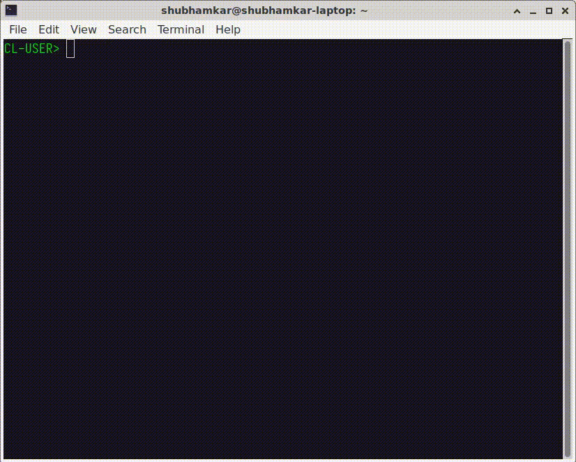
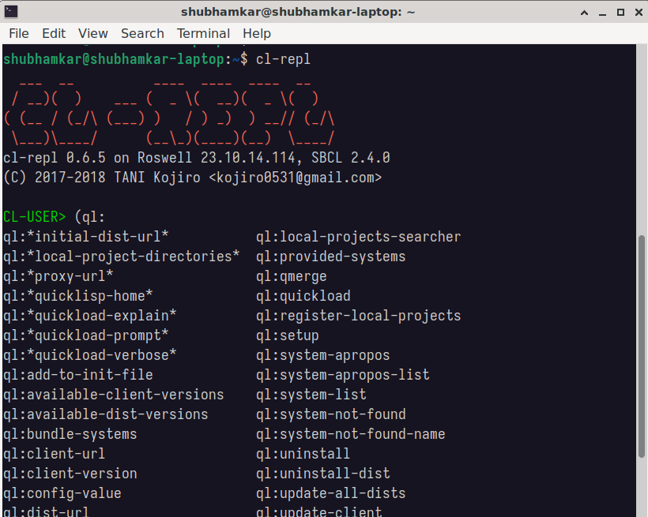
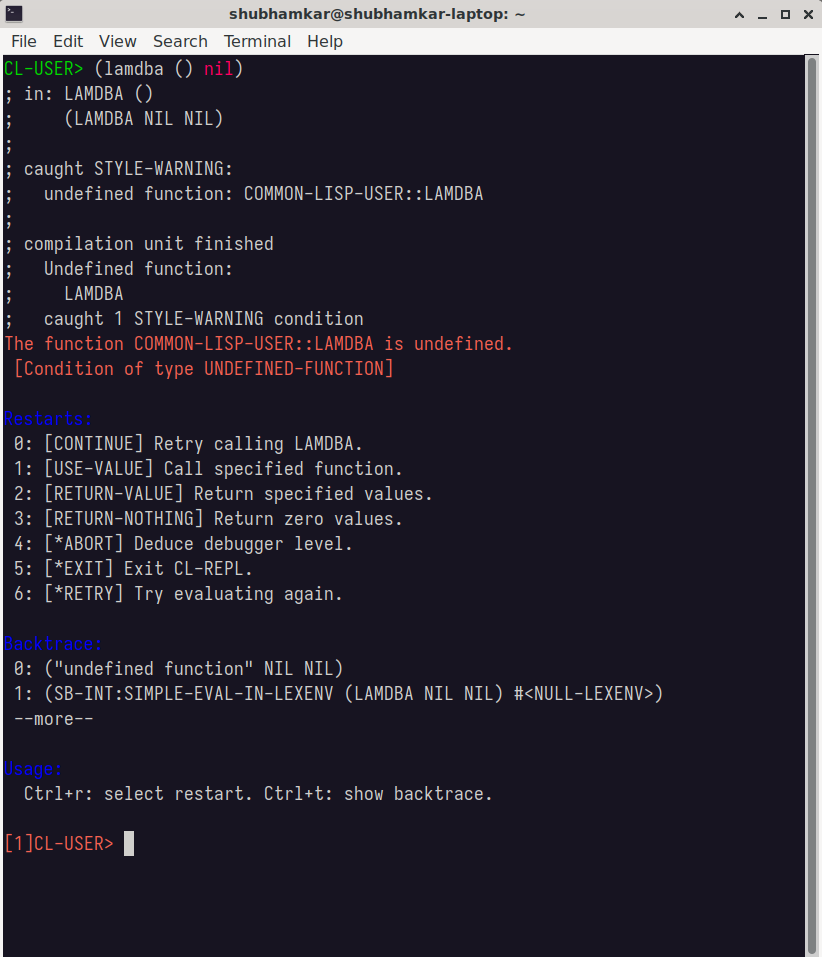

# CL-REPL

[](https://github.com/digikar99/cl-repl/blob/master/LICENSE)
[](https://github.com/digikar99/cl-repl/releases)

# **Warning; WIP**
The software is still alpha quality.
The functionalities are incomplete and may cause unkown bugs.

<!-- markdown-toc start - Don't edit this section. Run M-x markdown-toc-refresh-toc -->
**Table of Contents**

- [Overview](#overview)
- [Screenshots](#screenshots)
- [Installation](#installation)
    - [Method 1: Download the binary](#method-1-download-the-binary)
    - [Method 2: Rosswell](#method-2-rosswell)
        - [Note about installation via Roswell](#note-about-installation-via-roswell)
- [Usage](#usage)
    - [Configuration](#configuration)
    - [Syntax highlighting](#syntax-highlighting)
    - [execute shell](#execute-shell)
    - [%edit magic](#edit-magic)
- [Contributing](#contributing)
- [Author](#author)
- [License](#license)

<!-- markdown-toc end -->


# Overview
This project aims to provide a beginner-friendly REPL for Common Lisp with rich functionalities, such as IPython for Python.

What this project tries to achieve are listed here.

- [x] powerful multiline editing with gnu readline.
- [x] saving and loading multiline history.
- [x] tab-completion of symbols.
- [x] simple installation instruction.
- [x] code editting with text editor.
- [ ] useful debugger & inspector. (incomplete)
- [x] syntax highlighting of input texts.
- [x] paren-matching.
- [ ] implementation independence. (only SBCL supported)

# Screenshots

<p align="center" width="640px">
  
</p>

<p align="center" width="640px">
  
</p>

<p align="center" width="640px">
  
</p>

# Installation

## Method 1: Download the binary

Look up the latest release compatible with your OS under https://github.com/digikar99/cl-repl/releases.

If your choice of OS is not listed, you can help make lisping easier for others by contributing a PR. Take a look at the [.github/workflows/CI.yml](.github/workflows/CI.yml) for an inspiration. If it's unix-based, it might be as simple as adding a name to matrix -> OS.

## Method 2: Rosswell

CL-REPL can be installed via roswell as follows.

```
$ ros install digikar99/cl-repl
```

Before installation, please ensure that gnu readline is installed.
If you use OSX, you might need to execute following command.

```
$ brew link --force readline
```

Also, ensure that your terminal support 256 colors.

### Note about installation via Roswell

If you installed roswell with normal configurations, cl-repl will be located in `~/.roswell/bin`.  
To use cl-repl from the command line, please ensure the PATH variable includes `~/.roswell/bin`.

# Usage

```
$ cl-repl
```

or

```
$ ros repl
```

Some useful magic commands are ready to use. To list available commands:

```
CL-USER> %help
```

## Configuration
You can customize CL-REPL by editting `~/.replrc`. You can change appearance, add your own commands, and do anything you want when startup.
An example can be found [here](./replrc-example).

## Syntax highlighting
Syntax highlighiting of input area is new in v0.5.0.
If you want to disable it, put the following in your `.replrc`.

```
(disable-syntax)
```

## execute shell
If the line starts with `!`, excute it as shell command, e.g. `!ls -a`.

## %edit magic
Line editting in repl is sometimes painful. CL-REPL allows yot to edit code with your favorite text editor.

```
CL-REPL> %edit <filename>
```

CL-REPL invokes a text editor specified by `$EDITOR`.
After editting code, save and close it. Then repl will start to evaluate it.
If `<filename>` is not supplied, a temporary file will be created and deleted after evaluation.

We've be sure the following editors work properly.

- vi & vim
- GNU Emacs
- joe's own editor
- Lem

# Contributing
Don't hesitate to open issues or to send PRs.
Any suggestions are always welcomed.

# Author
[TANI Kojiro](https://github.com/koji-kojiro) (kojiro0531@gmail.com)

# Maintainer
[Shubhamkar Ayare](https://github.com/digikar99) (shubhamayare@yahoo.co.in)

# License
CL-REPL is distributed under [GPLv3](./LICENSE).
